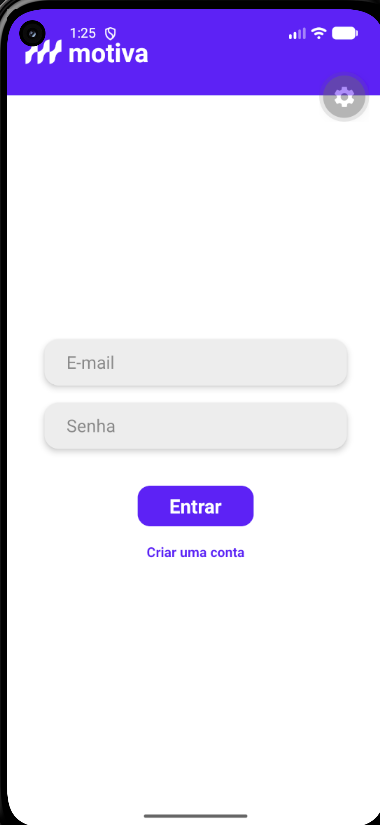
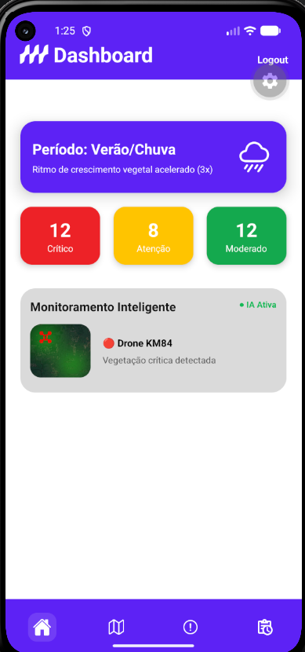
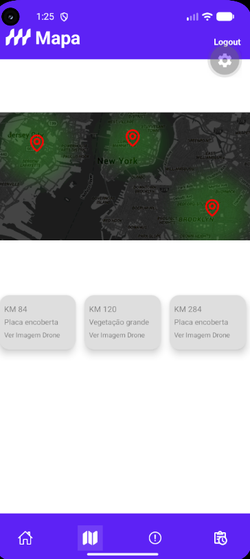
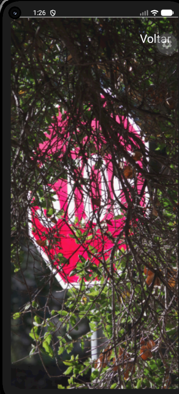
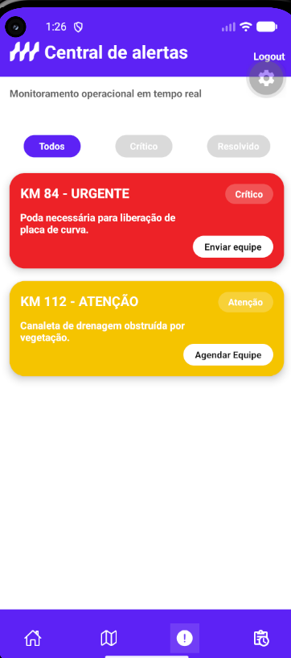
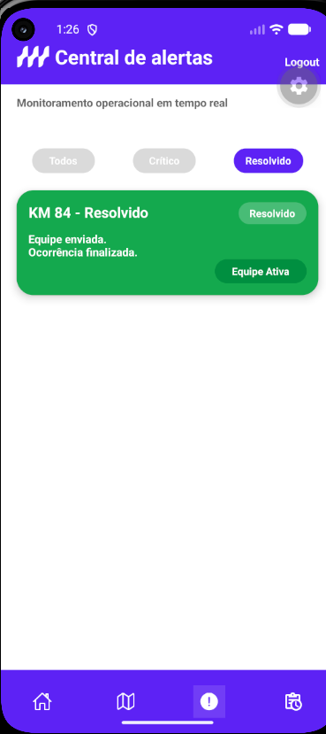
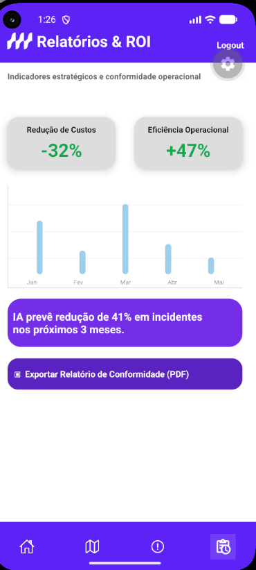
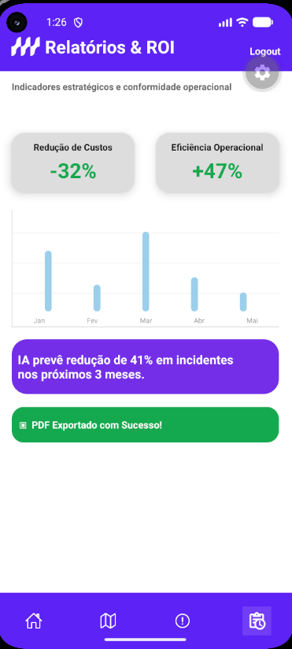

# Motiva Green Vision — Monitoramento Inteligente de Vegetação

Aplicativo mobile para monitoramento inteligente de vegetação e apoio à conservação de rodovias da concessionária Motiva.

O projeto foi desenvolvido como uma solução acadêmica para simular a identificação de trechos com crescimento excessivo de vegetação, obstrução de placas e outros riscos relacionados à conservação rodoviária.

---

## 👥 Integrantes do Grupo

| Integrante                   |     RM |
| ---------------------------- | -----: |
| Amom Ianaguivara Brito       | 565718 |
| Victor Chen                  | 565363 |
| Fernando Antônio de Oliveira | 562549 |
| Vinícius Mello Siqueira      | 565257 |
| Gabriel Ramos                | 564074 |

---

## 📌 Problema escolhido

O projeto busca resolver a **ineficiência e a escala limitada das inspeções visuais manuais** utilizadas na conservação das áreas verdes presentes ao longo das rodovias.

Atualmente, a identificação de problemas como mato alto, crescimento acelerado da vegetação e obstrução de placas depende do deslocamento frequente de equipes humanas pelas vias.

Esse modelo apresenta diferentes dificuldades:

* altos custos com combustível, veículos e equipes de inspeção;
* dificuldade para monitorar grandes extensões de rodovia;
* identificação tardia de ocorrências;
* manutenção predominantemente reativa;
* risco de vegetação encobrir placas e comprometer a visibilidade;
* possibilidade de penalidades aplicadas por órgãos reguladores, como ARTESP e ANTT;
* dificuldade para priorizar corretamente as equipes de poda e conservação.

O objetivo do projeto é automatizar parte desse processo, permitindo que os problemas sejam identificados e classificados antes que se tornem riscos graves para a segurança viária.

---

## 👤 Persona principal

### Roberto Silva

**Idade:** 42 anos
**Profissão:** Supervisor de Conservação Rodoviária

Roberto é responsável por coordenar as equipes de poda, roçagem, drenagem e manutenção de ativos distribuídos por aproximadamente 400 quilômetros de rodovia.

### Responsabilidades

* acompanhar as condições dos trechos sob concessão;
* coordenar equipes de conservação;
* definir prioridades de atendimento;
* acompanhar ocorrências críticas;
* evitar atrasos e penalidades regulatórias;
* produzir indicadores operacionais;
* comprovar a execução das atividades de manutenção.

### Dificuldades

Roberto possui pouca previsibilidade sobre quais trechos realmente precisam de intervenção.

Frequentemente, equipes são enviadas para locais que ainda não apresentam riscos significativos, enquanto outros pontos permanecem com vegetação elevada, placas encobertas ou canaletas obstruídas.

Além disso, as informações podem estar espalhadas em diferentes relatórios, dificultando uma visão geral da operação.

### Necessidade

Roberto precisa de uma ferramenta centralizada que informe:

* onde existe uma ocorrência;
* qual é o nível de criticidade;
* quais trechos precisam de atendimento imediato;
* onde a vegetação está crescendo rapidamente;
* quais equipes foram acionadas;
* quais ocorrências já foram resolvidas;
* quais resultados operacionais foram obtidos.

---

## 💡 Proposta de solução

A solução proposta é um aplicativo mobile chamado **Motiva Green Vision**, conectado conceitualmente a um ecossistema de monitoramento por satélite, drones e inteligência artificial.

O sistema utiliza um funil tecnológico dividido em três etapas.

### 1. Vigilância macro por satélite

Satélites realizam o monitoramento periódico da vegetação ao longo das rodovias por meio de indicadores como o NDVI, utilizado para analisar a presença e a intensidade da cobertura vegetal.

O satélite não calcula diretamente a altura da vegetação. Ele funciona como um primeiro filtro, identificando áreas com crescimento acelerado ou comportamento fora do padrão.

### 2. Inspeção localizada por drones

Depois que uma região é identificada como suspeita, um drone é direcionado até a coordenada do trecho.

O drone realiza uma inspeção visual mais detalhada, permitindo verificar situações como:

* vegetação elevada;
* placas de trânsito encobertas;
* canaletas de drenagem obstruídas;
* redução da visibilidade;
* riscos em curvas e acostamentos.

As imagens capturadas são disponibilizadas para o gestor dentro do aplicativo.

### 3. Inteligência sazonal e aplicativo mobile

Os dados coletados são classificados de acordo com a criticidade da ocorrência.

A solução considera fatores como período de chuva, crescimento sazonal da vegetação e nível de risco operacional.

O aplicativo apresenta os dados em três níveis principais:

* **Crítico:** necessita de intervenção imediata;
* **Atenção:** precisa ser programado para atendimento;
* **Moderado:** permanece em monitoramento.

Por meio do aplicativo, o supervisor pode consultar o mapa, visualizar imagens dos drones, acompanhar alertas, acionar equipes e analisar indicadores estratégicos.

---

## 📱 Funcionalidades implementadas

O protótipo funcional possui as seguintes funcionalidades:

* cadastro de usuário;
* validação dos campos do formulário;
* validação do formato de e-mail;
* validação de senha e confirmação de senha;
* login permitido somente para usuários cadastrados;
* mensagens de erro exibidas abaixo dos campos;
* armazenamento local dos dados do usuário;
* persistência da sessão;
* logout;
* dashboard com indicadores operacionais;
* identificação do período climático;
* apresentação de trechos críticos, em atenção e moderados;
* navegação por abas inferiores;
* mapa simulado de monitoramento;
* solicitação de permissão de localização;
* cards com trechos monitorados;
* visualização das imagens capturadas pelos drones;
* central de alertas;
* filtros de alertas;
* acionamento simulado de equipe;
* alteração do alerta para o estado resolvido;
* acompanhamento de equipe ativa;
* indicadores de redução de custos;
* indicadores de eficiência operacional;
* gráfico de desempenho;
* exportação simulada de relatório de conformidade.

---

## 🛠️ Stack tecnológica e justificativa

| Tecnologia            | Função no projeto                      | Justificativa                                                                                                      |
| --------------------- | -------------------------------------- | ------------------------------------------------------------------------------------------------------------------ |
| **JavaScript**        | Linguagem utilizada no desenvolvimento | Permite desenvolver a lógica do aplicativo de forma direta e possui integração completa com React Native e Expo.   |
| **React Native**      | Framework principal                    | Permite desenvolver aplicações para Android e iOS utilizando uma única base de código.                             |
| **Expo**              | Ambiente de desenvolvimento            | Simplifica a criação, execução e teste do aplicativo em dispositivos físicos e emuladores.                         |
| **React Navigation**  | Navegação entre telas                  | Permite criar a navegação em pilha e o menu inferior utilizado entre Dashboard, Mapa, Alertas e Relatórios.        |
| **Expo Location**     | Serviço de localização                 | Permite solicitar a localização do dispositivo e simular o uso de coordenadas geográficas nos trechos monitorados. |
| **AsyncStorage**      | Armazenamento local                    | Mantém os dados do usuário e da sessão salvos no dispositivo, mesmo após o aplicativo ser fechado.                 |
| **Expo Vector Icons** | Ícones da interface                    | Disponibiliza ícones compatíveis com o Expo para as abas, alertas, mapa e elementos visuais da aplicação.          |
| **Android Studio**    | Emulador Android                       | Utilizado para executar e validar o aplicativo em um dispositivo virtual Pixel 5.                                  |
| **Figma**             | Prototipação                           | Utilizado para criar o protótipo navegável de alta fidelidade e definir a identidade visual do aplicativo.         |

---

## 📋 Requisitos funcionais

| Código     | Requisito                                                                                            |
| ---------- | ---------------------------------------------------------------------------------------------------- |
| **RF-001** | O aplicativo deve permitir o cadastro do usuário com nome, e-mail, RM, senha e confirmação de senha. |
| **RF-002** | O aplicativo deve validar o preenchimento dos campos obrigatórios.                                   |
| **RF-003** | O aplicativo deve permitir o login somente de usuários previamente cadastrados.                      |
| **RF-004** | O aplicativo deve manter os dados do usuário armazenados localmente.                                 |
| **RF-005** | O aplicativo deve permitir que o usuário encerre sua sessão por meio do botão de logout.             |
| **RF-006** | O aplicativo deve exibir um dashboard com indicadores de trechos críticos, em atenção e moderados.   |
| **RF-007** | O aplicativo deve apresentar um mapa contendo os pontos monitorados.                                 |
| **RF-008** | O usuário deve poder visualizar imagens associadas às inspeções dos drones.                          |
| **RF-009** | O aplicativo deve apresentar uma central de alertas operacionais.                                    |
| **RF-010** | O usuário deve conseguir filtrar os alertas por situação.                                            |
| **RF-011** | O usuário deve conseguir acionar ou agendar uma equipe por meio de um alerta.                        |
| **RF-012** | O aplicativo deve alterar o estado do alerta após o acionamento da equipe.                           |
| **RF-013** | O aplicativo deve apresentar indicadores de custos e eficiência operacional.                         |
| **RF-014** | O aplicativo deve simular a exportação de um relatório de conformidade.                              |
| **RF-015** | O aplicativo deve solicitar permissão para acessar a localização do dispositivo.                     |

---

## ⚙️ Requisitos não funcionais

| Código      | Requisito                                                                                       |
| ----------- | ----------------------------------------------------------------------------------------------- |
| **RNF-001** | O aplicativo deve possuir interface responsiva e adaptável a diferentes tamanhos de tela.       |
| **RNF-002** | O aplicativo deve seguir a identidade visual institucional baseada nas cores roxa e branca.     |
| **RNF-003** | As telas devem possuir navegação simples e intuitiva.                                           |
| **RNF-004** | Os dados utilizados na demonstração devem ser mockados, sem dependência de APIs externas.       |
| **RNF-005** | O aplicativo deve funcionar em um emulador Android Pixel 5.                                     |
| **RNF-006** | O projeto deve utilizar JavaScript, sem TypeScript.                                             |
| **RNF-007** | Os dados locais devem permanecer disponíveis após o aplicativo ser fechado.                     |
| **RNF-008** | O carregamento das informações simuladas deve ocorrer em até três segundos.                     |
| **RNF-009** | Os erros dos formulários devem ser exibidos de maneira clara, sem depender de caixas de alerta. |

---

## 🎨 Identidade visual

A interface foi desenvolvida com base no protótipo de alta fidelidade criado no Figma.

A identidade visual utiliza principalmente:

* roxo institucional;
* fundo branco;
* cards arredondados;
* sombras suaves;
* indicadores por cores;
* vermelho para ocorrências críticas;
* amarelo para ocorrências de atenção;
* verde para ocorrências resolvidas;
* navegação inferior por ícones.

---

## 🖼️ Capturas de tela

### Login



### Cadastro


### Dashboard



### Mapa de monitoramento



### Imagem capturada pelo drone



### Central de alertas



### Ocorrência resolvida



### Relatórios e ROI



### Relatório exportado



---

## 🗂️ Estrutura principal do projeto

```text
motiva-prototipo/
├── assets/
│   ├── prints/
│   │   ├── login.png
│   │   ├── cadastro.png
│   │   ├── dashboard.png
│   │   ├── mapa.png
│   │   ├── drone.png
│   │   ├── alertas.png
│   │   ├── alerta-resolvido.png
│   │   ├── relatorios.png
│   │   └── relatorio-exportado.png
│   ├── simbolo-motiva.png
│   ├── monitoramento.png
│   ├── mapa.png
│   ├── drone1.png
│   ├── drone2.png
│   └── drone3.png
│
├── src/
│   ├── components/
│   ├── data/
│   ├── navegacao/
│   ├── storage/
│   └── telas/
│
├── App.js
├── app.json
├── package.json
└── README.md
```

---

## 🚀 Como executar o projeto

### Pré-requisitos

Antes de executar o projeto, é necessário possuir:

* Node.js;
* npm;
* Expo;
* Android Studio;
* emulador Android configurado.

### Instalação

Clone o repositório:

```bash
git clone URL_DO_REPOSITORIO
```

Entre na pasta:

```bash
cd motiva-prototipo
```

Instale as dependências:

```bash
npm install
```

Inicie o projeto:

```bash
npx expo start
```

Com o emulador Pixel 5 aberto, pressione:

```text
a
```

Também é possível executar diretamente no Android:

```bash
npx expo start --android
```

Caso seja necessário limpar o cache:

```bash
npx expo start --clear
```

---

## 📦 Dependências utilizadas

Caso seja necessário instalar manualmente as dependências, utilize:

```bash
npm install @react-navigation/native
```

```bash
npx expo install react-native-screens react-native-safe-area-context
```

```bash
npm install @react-navigation/native-stack
```

```bash
npm install @react-navigation/bottom-tabs
```

```bash
npx expo install expo-location
```

```bash
npx expo install @react-native-async-storage/async-storage
```

```bash
npx expo install @expo/vector-icons
```

---

## 🎨 Protótipo navegável

O protótipo de alta fidelidade apresenta a jornada do usuário, incluindo:

* login;
* dashboard;
* mapa;
* inspeções por drone;
* central de alertas;
* acionamento de equipe;
* alertas resolvidos;
* relatórios;
* exportação simulada.

🔗 [Acessar o protótipo no Figma](https://www.figma.com/design/Y3wKlkhxwHISzipeRF67d3/Prot%C3%B3tipo-app---challenge-motiva?node-id=0-1&t=trR4pVo4QEATt4zK-1)

---

## 🧪 Dados simulados

O aplicativo utiliza dados mockados para representar:

* quantidade de trechos críticos;
* ocorrências em atenção;
* áreas moderadas;
* informações sazonais;
* coordenadas e trechos rodoviários;
* imagens de inspeção;
* alertas operacionais;
* estados das equipes;
* indicadores de custos;
* eficiência operacional.

Não existe dependência de APIs externas para o funcionamento do protótipo.

---

## ⚠️ Observações

Este projeto possui finalidade acadêmica e utiliza dados simulados.

O AsyncStorage é utilizado para demonstrar a persistência local de cadastro e sessão. Em uma aplicação real, dados sensíveis, como senhas, não devem ser armazenados dessa forma sem criptografia e mecanismos adequados de segurança.

A exportação do relatório em PDF é simulada visualmente e não gera um documento real.

---

## 📄 Licença

Projeto desenvolvido exclusivamente para fins acadêmicos.
